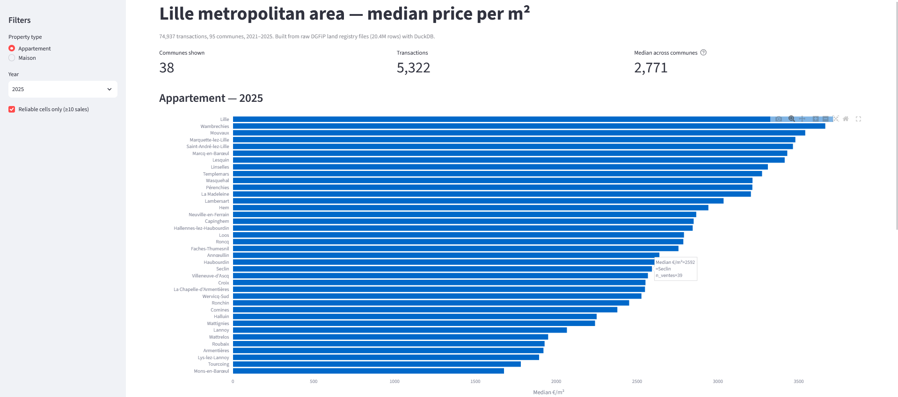
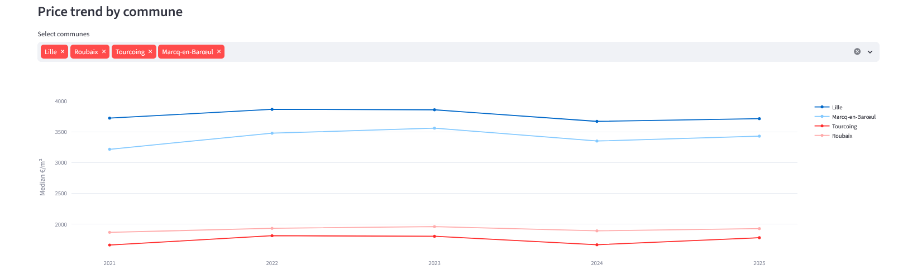

# Lille property market — from raw land registry files to a public dashboard

Median price per m² by commune, property type and year for the 95 communes of
the Métropole Européenne de Lille (2021–2025), built from raw DGFiP *Demandes
de Valeurs Foncières* files.

**[→ Live dashboard](https://dvf-mel.streamlit.app)**



---

## What this project is about

DVF is the French open land registry: every property transaction, nationwide,
published twice a year. It is also close to unusable as distributed.

A single sale is spread across one row per parcel and per lot, with the total
price repeated on every row — **2.69 rows per transaction** in 2021, meaning
63% of the raw file is duplication. There is no transaction identifier. Prices
use French decimal commas, dates are DD/MM/YYYY, and commune codes are not
zero-padded. Block sales of entire apartment buildings sit alongside ordinary
house sales with no flag distinguishing them.

A pre-cleaned version exists (Cerema). This project deliberately starts from
the raw files, because the cleaning is where the work is.

**Input:** 5 files, 20,382,915 rows, 2.6 GB
**Output:** 795 median price cells covering 74,937 transactions
**Runtime:** full rebuild from raw files in under 10 seconds

---

## Stack

| | |
|---|---|
| **DuckDB** | Reads multi-GB pipe-delimited files in place — no import, no server, no data loaded into RAM. Full 5-file scan: 2.4s |
| **SQL** | The entire pipeline, four scripts |
| **Streamlit + Plotly** | Public dashboard |
| **geo.api.gouv.fr** | Commune perimeter, pulled from source rather than hardcoded |

---

## Method

### Rebuilding the transaction identifier

DVF ships no `id_mutation`. Rows are collapsed on a composite key:
`Date mutation + No disposition + Valeur fonciere + Code departement + Code commune`.

This key has two failure modes, in opposite directions — it can merge two
unrelated sales, and it can split one real sale across communes. Both were
measured rather than assumed. Genuine same-department fragmentation affects
**0.07%** of the eligible population, an order of magnitude below the
uncertainty introduced by the other filters. The audit, including two
measurement errors made and corrected along the way, is in
[`docs/filter_log.md`](docs/filter_log.md).

### One price, one property

A price per m² only means something when the price can be attributed to a
single dwelling. Mutations are kept only when they contain **exactly one built
property** — one house or one flat, outbuildings excluded from the count. This
removes block sales where a single figure covers eight flats and twelve
cellars.

### The filter cascade

| # | Filter | Remaining | Dropped |
|---|--------|-----------|---------|
| 0 | MEL mutations, deduplicated | 109,184 | — |
| 1 | `Nature mutation = 'Vente'` | 99,391 | 9,793 |
| 2 | Non-null transaction value | 98,928 | 463 |
| 3 | Exactly one built property | 76,975 | 21,953 |
| 4 | No commercial premises | 75,404 | 1,571 |
| 5 | Built surface > 0 | 75,388 | 16 |
| 6 | Price ≥ €10,000 | 75,298 | 90 |
| 7 | Built surface 9–400 m² | 75,287 | 11 |
| 8 | €/m² between 500 and 15,000 | 74,937 | 350 |

**Retention: 68.6%.** Of the 20% lost at step 3, three quarters is bare land
(agricultural plots, woods) which carries no built surface and is out of scope
by nature; genuine multi-dwelling sales account for 6.1%.

Outlier bounds come from domain reasoning, not percentiles: 9 m² is the legal
minimum surface for a habitable dwelling in France, and €15,000/m² sits well
above prime Vieux-Lille.

### Median, never mean

Property prices are strongly right-skewed and DVF retains structural outliers
no filter removes cleanly — a €722.6M "house" of 119 m² (portfolio transfer),
a €132,000 flat recorded as 1 m² (missing surface).

---

## A hypothesis that turned out wrong

DVF reports the full transaction price but only the built surface of the main
dwelling, so a flat sold with a cellar and a parking space should show an
inflated €/m². The aggregate numbers agreed: €2,617/m² with no outbuilding,
€3,128 with three or more.

Controlling for property type reversed it. Flats with **no** outbuilding are
the most expensive per m² (€3,523) because they are studios — 40 m² median
surface against 83 m² for flats with three or more outbuildings. Small units
command a premium per square metre and rarely come with a cellar. The pattern
was composition, not pricing.

A real effect survives for houses, where median surface is stable: +5.7% for
3+ outbuildings, on 271 sales. Outbuildings are retained — excluding them
would cost 40% of the sample to correct a 5% bias on a marginal subgroup.

---

## Does it hold up?

Two checks, neither of them tuned for.

**The market cycle.** Lille flats: €3,722/m² (2021) → €3,864 (2022) → €3,857
(2023) → €3,669 (2024) → €3,713 (2025), with volume falling from 3,142 to
2,057 sales before recovering. That is the French rate-driven contraction and
subsequent stabilisation, reproduced from raw files.

**Local geography.** The 2025 house ranking puts Bondues, Marcq-en-Barœul and
Lambersart at the top, Roubaix and Wattrelos at the bottom — the social
geography of the metropolitan area, recognisable to anyone who knows it.



---

## Reproducing this

```bash
git clone https://github.com/jbmxx/dvf-mel.git
cd dvf-mel
```

Download the DVF files for 2021–2025 from
[data.economie.gouv.fr](https://www.data.economie.gouv.fr/explore/dataset/demandes-de-valeurs-foncieres-agregees/)
into `data/raw/`, then:

```bash
duckdb dvf.duckdb \
  ".read sql/01_reference.sql" \
  ".read sql/02_build_mutations.sql" \
  ".read sql/03_clean.sql" \
  ".read sql/04_aggregate.sql"
```

To run the dashboard locally:

```bash
pip install -r requirements.txt
streamlit run app.py
```

The pipeline was validated by deleting the database and rebuilding from
scratch: 795 cells, 74,937 transactions, identical figures.

---

## Repository

```
sql/01_reference.sql        Commune perimeter from geo.api.gouv.fr
sql/02_build_mutations.sql  Row-level DVF → mutation-level table
sql/03_clean.sql            Quality filters and outlier bounds
sql/04_aggregate.sql        Median €/m² by commune × type × year
app.py                      Streamlit dashboard
docs/filter_log.md          Every filter, quantified and justified
data/ref/                   Commune list and aggregated output (versioned)
```

Raw DVF files are not versioned — 2.6 GB, freely redistributed by DGFiP.

---

## Known limitations

- **Lomme and Hellemmes-Lille** hold their own INSEE codes but DVF reports them
  under Lille. Lille's median blends three distinct submarkets; this cannot be
  disaggregated from DVF alone.
- **Small communes.** Cells below 10 sales are flagged rather than deleted (a
  missing cell reads as a bug, a flagged one reads as a documented limitation).
  Even above the threshold, a commune with 11 transactions produces an unstable
  median — the top of the ranking is most reliable for high-volume communes.
- **VEFA** (off-plan sales) often carry no surface and fall out at step 5. They
  are not analysed separately here.
- **Composite key.** 0.07% residual fragmentation, measured and bounded.

## Possible extensions

Cross-referencing with the [rent map](https://www.data.gouv.fr/datasets/carte-des-loyers-indicateurs-de-loyers-dannonces-par-commune/)
published on data.gouv.fr would give a gross rental yield per commune, joining
on the same INSEE key.

---

## Data source

DGFiP, *Demandes de Valeurs Foncières*, [Licence Ouverte / Open Licence 2.0](https://www.etalab.gouv.fr/licence-ouverte-open-licence).
Commune perimeter: [geo.api.gouv.fr](https://geo.api.gouv.fr), EPCI 200093201.